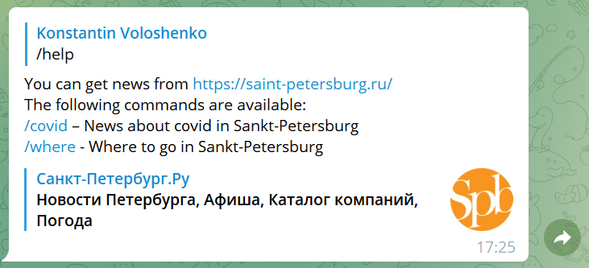
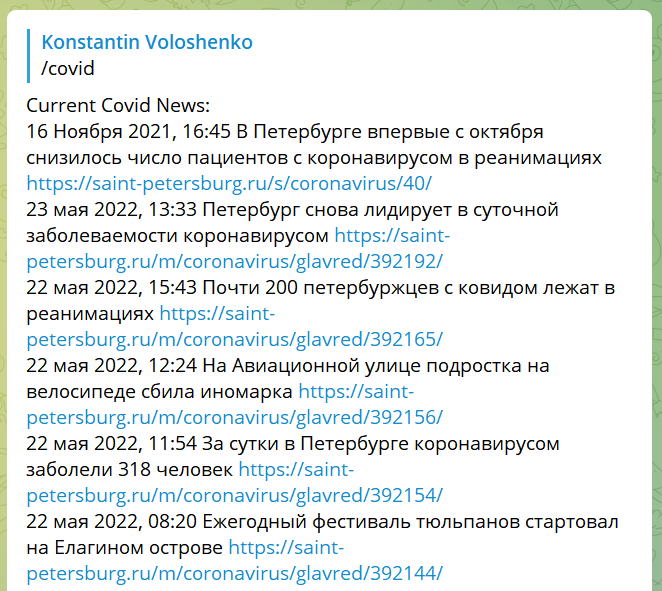
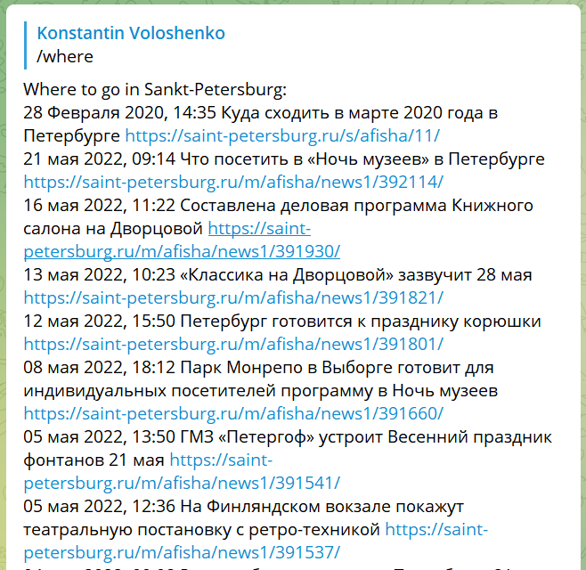

# PDD_15_hw
Python: Telegram bot

## Bot name: kv_20220523_1
## Bot user name: kv_20220523_1_bot
### Description: 
You can get news from https://saint-petersburg.ru/
### Available commands
The following commands are available:
/helt - To get help info

/covid – News about covid in Sankt-Petersburg

/where - Where to go in Sankt-Petersburg

### Start the bot
For starting the bot run tg_bot_spb.py
### Dependencies
The bot uses module parser_html.parser_v01
### Note: The file with token is not included to this repository!

